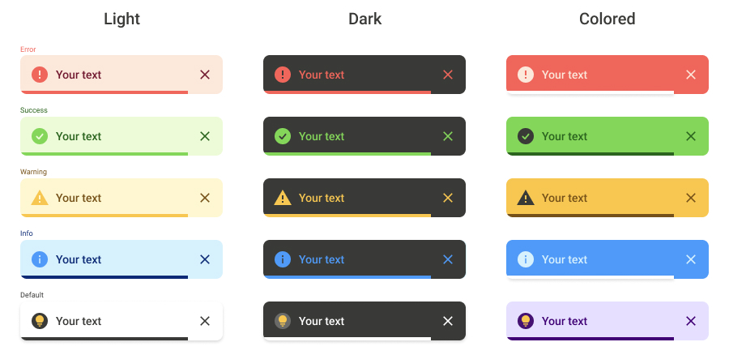

# React-toastic

*The library is designed for personal use. But if you install it I would be very pleased.*

## Preview



## Installation

```
npm i react-toastic
yarn add react-toastic
```

## Use

```jsx
import {ToastContainer, toast} from 'react-toastic';

function App() {

    const example = () => toast("Your text");

    return (
        <div>
            <button onClick={example}>click me</button>
            <ToastContainer/>
        </div>
    );
}
```

```jsx
//Toast calling options

toast("Your text")
toast.error("Your text")
toast.info("Your text")
toast.success("Your text")
toast.warning("Your text")
```

You can change the toast as you like, below is the full api table:

```jsx
toast('Your text', {
    type: 'success',
    position: 'bottom-right',
    timeout: '8000',
    animateIcon: true,
    icon: <YourIcon/>,
    style: {
        toast: {
            background: '#98789',
            color: '#551515',
            boxShadow: '0px 2px 4px rgba(0, 0, 0, 0.15)'
            //....
        },
        progress: {
            background: '#98789',
        },
        close: {
            background: '#98789'
        }
    }
    //...
});
```

Configure the default settings for all toast messages by passing the ToastContainer `config`

```tsx
// index.tsx
import {ToastContainer, ConfigToastType} from 'react-toastic';

const config: ConfigToastType = {
    position: 'bottom-center',
    timeout: '8000',
    pauseOnHover: true,
    style: {
        //theme
        light: {
            //type
            error: {
                toast: {
                    background: '#98789',
                    color: '#551515',
                    borderRadius: '12px'
                    //....
                }
            }
        }
    }
    //...
}

<ToastContainer config={config}/>
```

## API

| Parameter      | Type                 | Description                                                                                                                                       | Default       |                                              
|----------------|----------------------|---------------------------------------------------------------------------------------------------------------------------------------------------|---------------|
| `position`     | `string`             | The toast position is set. Available options are `'top-right'`, `'top-left'`, `'top-center'`,`'bottom-right'`, `'bottom-left'`, `'bottom-center'` | `'top-right'` |
| `theme`        | `string`             | The color theme of the toast is defined. Available options are `'light'`,  `'dark'`, `'colored'`                                                  | `'light'`     |
| `type`         | `string`             | Available options are `'info'`, `'success'`,  `'warning'`, `'error'`                                                                              | `'default'`   |
| `transition`   | `boolean`            | Determines which animation will be used.Available options are `'skew'` , `'zoom'` , `'slide'` , `'drop'`                                          | `'slide'`     |
| `title`        | `string`             | The header for toast is set.                                                                                                                      | `false`       |  
| `timeout`      | `number` `undefined` | Define toast time. If you specify 0 or undefined, toast will close only on click and also no progress bar will appear                             | `5000`        |
| `icon`         | `JSX.Element`        | Ability to insert your own icon                                                                                                                   | `undefined`   |
| `hiddenIcon`   | `boolean`            | hides the icon                                                                                                                                    | `false `      |
| `animateIcon`  | `boolean`            | Adds animation to icons. Works only with native icons                                                                                             | `false`       |
| `closeOnClick` | `boolean`            | Closes toast on click                                                                                                                             | `false`       |
| `pauseOnHover` | `boolean`            | Stops progress animation when hovering                                                                                                            | `false`       |
| `style`        | `------`             | Consider below                                                                                                                                    | `undefined`   |

Let's look at `style` separately

```tsx
//Structure

type StyleT = {
    toast?: CSSProperties;
    close?: {
        background: CSSProperties.background;
    };
    progress?: CSSProperties;
}
```
If you want to change the styles for each theme and each type in config, you need:

```tsx
//Structure

type ConfigStyleT = {
    light?: {
        info?: StyleT; 
        success?: StyleT; 
        warning?: StyleT; 
        error?: StyleT; 
        default?: StyleT
    },
    dark?: {},
    colored?: {}
}
```

Thank you so much for using the library ❤️. If you have any suggestions or comments ✉️, I'm always willing to work on them

*This project has an MIT License.*


